

    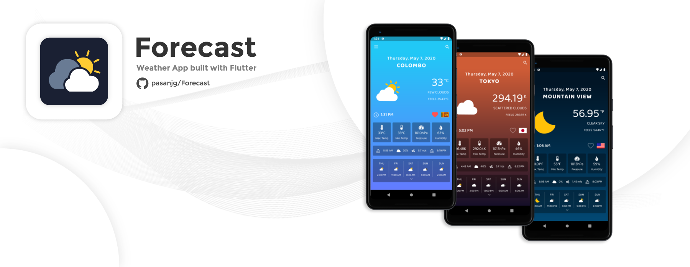

    
    
    
    
    

## Preview

    

## Screenshots

<table>
  <tr>
    <td>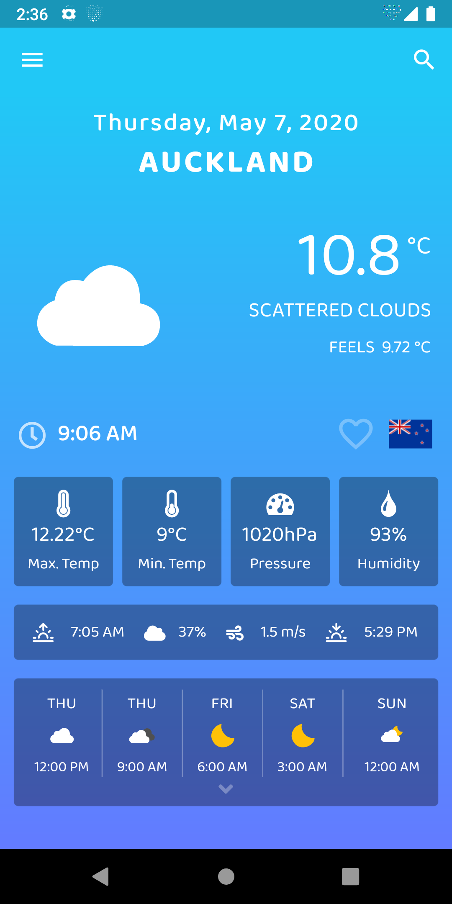</td>
    <td>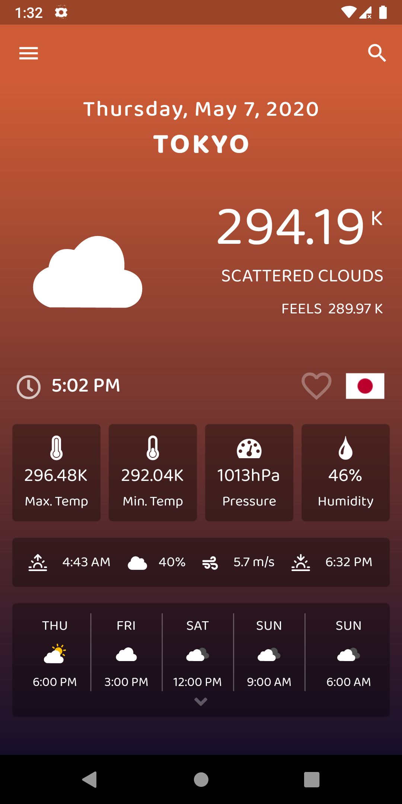</td>
    <td>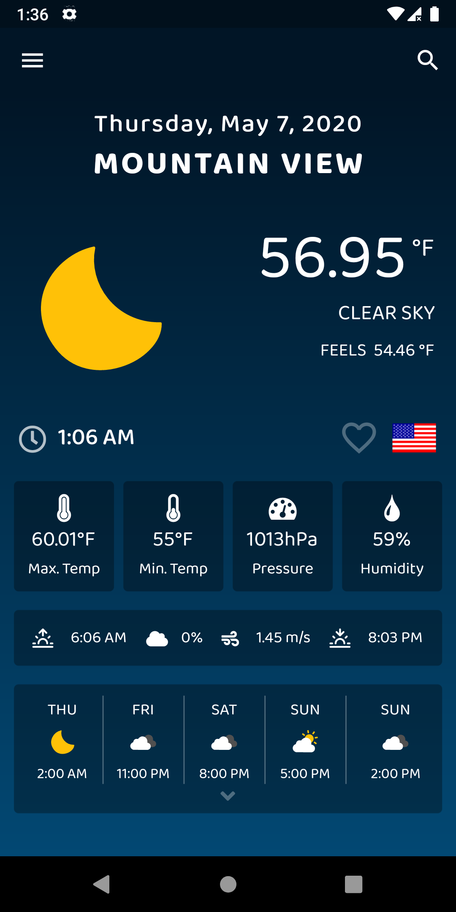</td>
    <td>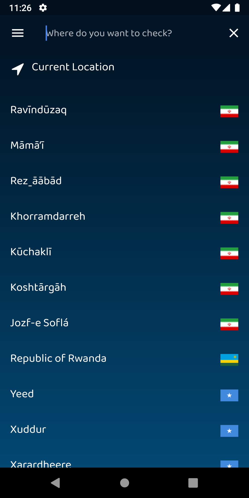</td>
    <td>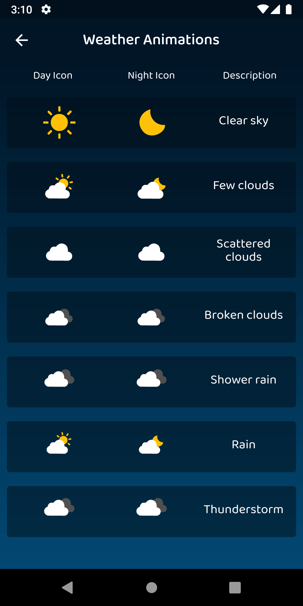</td>
  </tr>
  <tr>
    <td>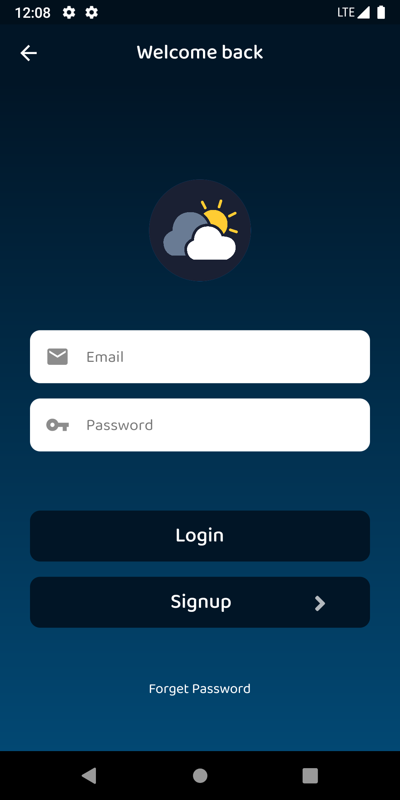</td>
    <td>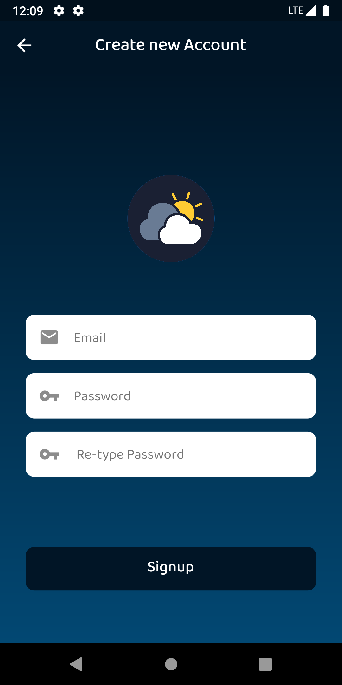</td>
    <td>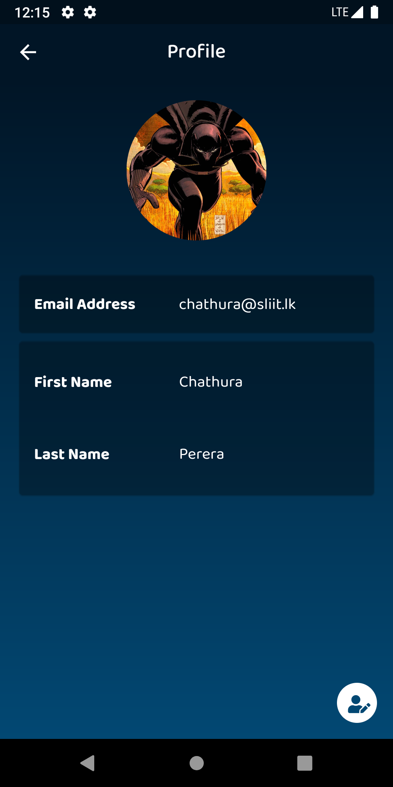</td>
    <td>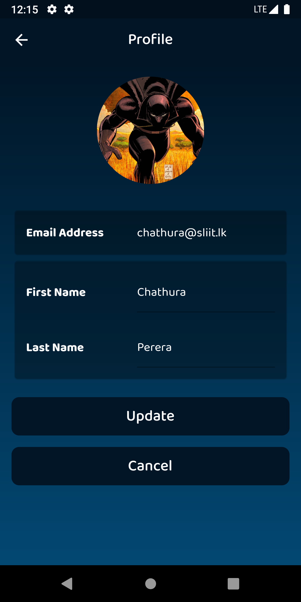</td>
    <td>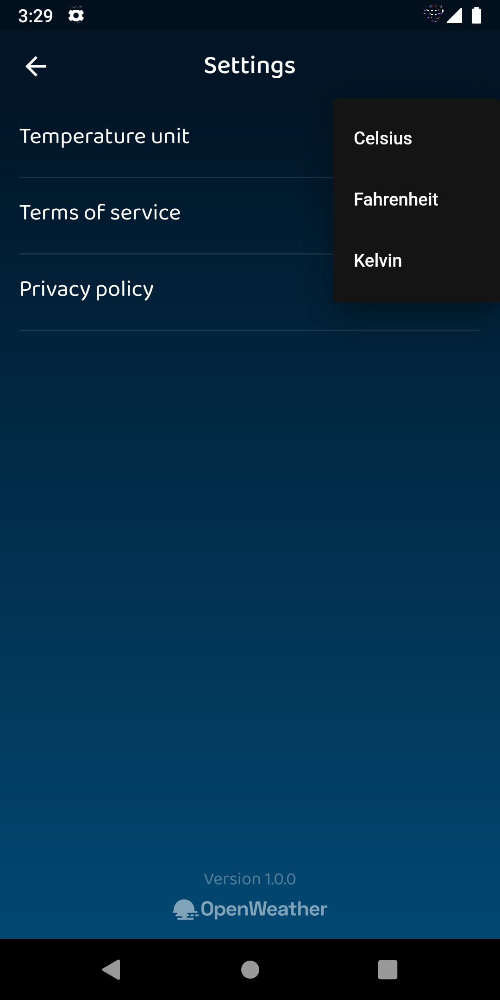</td>
  </tr>
</table>

Flare Animations created with [   Rive](https://rive.app/)

## Contributors

